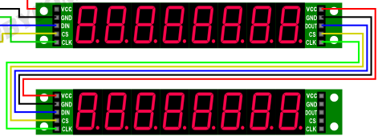
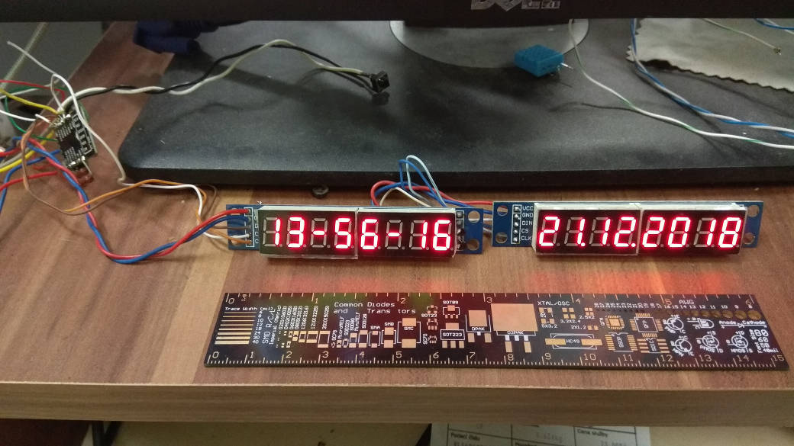
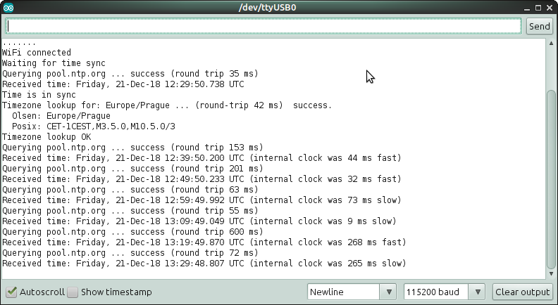

# esp8266-ezTIME-wifi-clock
Simple arduino clock using ESP8266, ezTIME NTP library and MAX7219 LED display modules.

## Software setup:
* install latest arduino + ESP8266 support, ezTime library, esp8266-hw-spi-max7219-7seg library
* change your timezone, WiFi SSID and password in the source
* upload into ESP8266

## Hardware setup:
Connect first MAX7219 LED display to the ESP this way:
* GPIO13  ->  DIN
* GPIO14  ->  CLK
* GPIO05  ->  CS

Second display is chained to the first one:

Power both displays from +5V (Vin), don't use 3.3V output of ESP (this will fry the 3.3V voltage regulator on ESP board).

## Have a fun!

See https://github.com/BugerDread/cryptoticker-by-dread-cz if you want to turn them into Bitcoin / altcoin ticker (uses the same HW setup).
